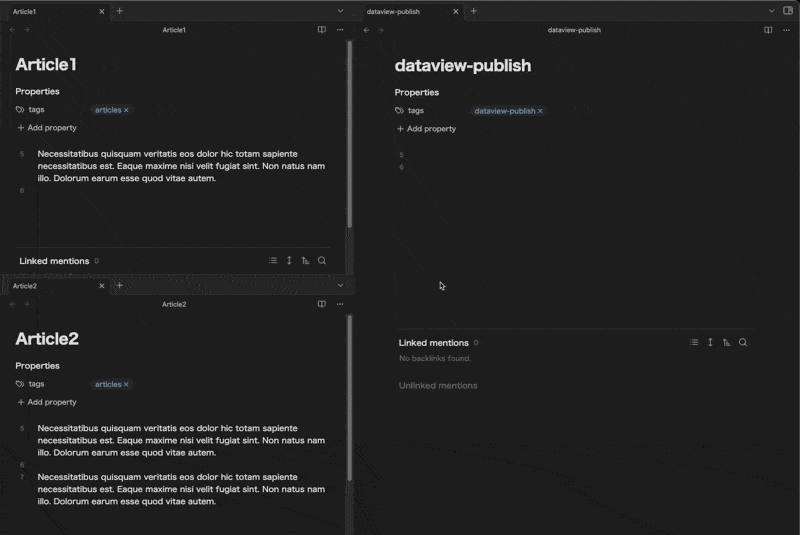
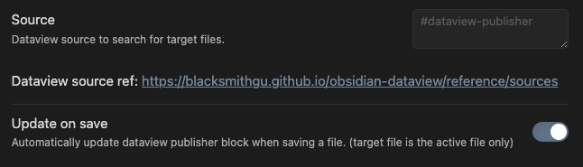
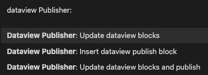

# Davaview Publisher

## Overview

Output markdown from your [Dataview](https://blacksmithgu.github.io/obsidian-dataview) queries and keep them up to date.
You can also be able to [publish](https://obsidian.md/publish) them.

## Screenshots



## Prerequisites

This plugin uses the following two plugins, so you must install them:

- [Dataview](https://blacksmithgu.github.io/obsidian-dataview)
- [Publish](https://obsidian.md/publish) (Core Plugin)

## Installation

### Installing the plugin using BRAT

1. Install the BRAT plugin
    1. Open `Settings` -> `Community Plugins`
    2. Disable safe mode, if enabled
    3. *Browse*, and search for "BRAT" 
    4. Install the latest version of **Obsidian 42 - BRAT**
2. Open BRAT settings (`Settings` -> `Obsidian 42 - BRAT`)
    1. Scroll to the `Beta Plugin List` section
    2. `Add Beta Plugin`
    3. Specify this repository: `udus122/dataview-publisher`
3. Enable the `Checkbox Time Tracker` plugin (`Settings` -> `Community Plugins`)

## Usage

```
%% DATAVIEW_PUBLISHER: start
```dataview
<Your favorite Dataview query>
```
%%
<Query results will be output as markdown here>
%% DATAVIEW_PUBLISHER: end %%
```

### Example

Display a list of files tagged with `#articles`
There are two notes tagged with `#articles` in the Vault (Article1.md, Article2.md).

```
%% DATAVIEW_PUBLISHER: start
```dataview
LIST FROM #articles SORT file.name
```
%%
- [[Article1.md|Article1]]
- [[Article2.md|Article2]]
%% DATAVIEW_PUBLISHER: end %%
```

### Settings



- Source: [Dataview source](https://blacksmithgu.github.io/obsidian-dataview/reference/sources) to search for the target file
  - This setting is used to narrow down the files to be updated, and is recommended for performance reasons
  - If left empty, this plugin will attempt to update all files in the Vault
- Update on save: Automatically update output when file is saved
  - Only the Saved file is updated.

### Commands



- Insert dataview publish block
  - Insert Dataview Publisher Template at next line of cursor
- Update dataview publish blocks
  - Update all Dataview Publish blocks for the files that correspond to the specified Source in settings.
- Update dataview publish blocks and open publish panel
  - Same as "Update dataview publish blocks" and open publish panel.

## Inspirations

This plugin highly inspirated by this article.

[Using Dataview on Obsidian Publish](https://joschua.io/posts/2023/09/01/obsidian-publish-dataview)

